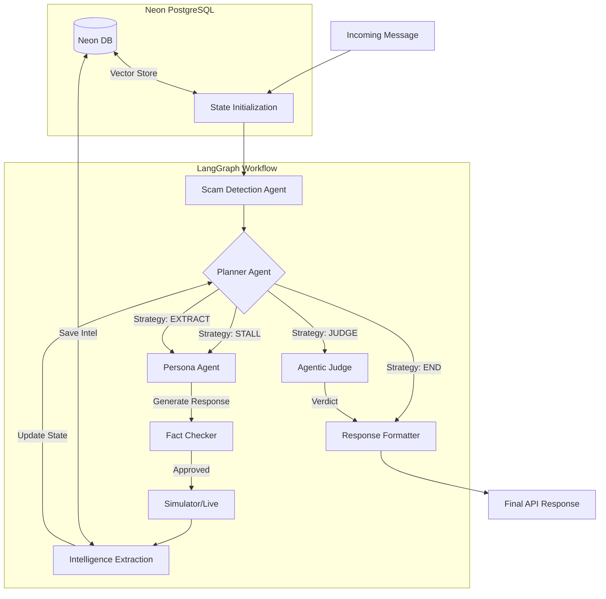

# Neepot AI: Agentic Honey-Pot System

**Neepot AI** is an advanced, autonomous scambaiting system designed to detect, stall, and extract high-value intelligence from cyber-scammers. Powered by **Google Gemini 2.5 Flash** and **LangGraph**, it deploys a team of specialized agents that collaborate to waste scammers' time while mining actionable data (Bank Accounts, UPI IDs, Phishing Links).

## 🚀 Key Features

- **🧠 Strategic Planner**: The "Brain" of the system. Enforces a **mandatory 5-turn minimum engagement** to build trust (STALL phase) before pivoting to aggressive data harvesting (EXTRACT phase).
- **🎭 Adaptive Persona**: Dynamically generates victim profiles (e.g., "confused elderly person", "anxious student") to match the specific scam topology.
- **🛡️ Sticky Detection**: Once a scam is detected, the system locks into "Honeypot Mode", preventing scammers from resetting the conversation flow.
- **🔍 Hardened Extraction**: A dual-layer pipeline (Deterministic Regex + LLM Verification) with **normalization** and **disambiguation** to ensure phone numbers aren't misclassified as bank accounts.
- **⚡ Gemini 2.5 Flash**: Optimized for speed and low latency, enabling near real-time responses.
- **📊 Live Dashboard**: Real-time visualization of ongoing engagements, extracted entities, and scam topologies.

## 🏗️ System Architecture

The system is architected as a stateful graph using **LangGraph**, enabling cyclic and self-correcting agentic behaviors.



### Core Agents

1.  **Planner Agent (`agents/planner.py`)**:
    - Decides **WHEN** to act.
    - Enforces the "Stall then Extract" pacing.
    - Prevents early exits before Turn 5.
2.  **Persona Agent (`agents/persona_engagement.py`)**:
    - Decides **HOW** to act.
    - Adopts the "Curious but Cautious" tone.
    - Uses `strategy_hint` inputs (e.g., "STALL: Feign confusion") to guide responses.

3.  **Intelligence Extraction Agent (`agents/intelligence_extraction.py`)**:
    - Mines entities from every message.
    - **New**: Includes `normalize_phone_number` and `disambiguate_entities` to clean data.

4.  **Fact Checker (`agents/fact_checker.py`)**:
    - Ensures the Persona's claims are consistent with the generated profile (e.g., age, location).

## 🛠️ Technology Stack

- **LLM**: Google Gemini 2.5 Flash
- **Orchestration**: LangGraph
- **Backend**: FastAPI (Python 3.10+)
- **Database**: Neon PostgreSQL + pgvector
- **Search**: Serper API (for fact-checking)
- **Validation**: Pydantic

## 📦 Setup & Deployment

### 1. Environment Variables

Create a `.env` file:

```bash
# Gemini API
GEMINI_API_KEY=AIza...
PLANNER_MODEL=gemini-2.5-flash

# Memory
DATABASE_URL=postgres://...
POSTGRES_ENABLED=true

# Security
API_SECRET_KEY=your_secret_key

# Operational
MAX_ENGAGEMENT_TURNS=10
SCAM_DETECTION_THRESHOLD=0.6
```

### 2. Installation

```bash
pip install -r requirements.txt
```

### 3. Run Server

```bash
python main.py
```

The server will start on `0.0.0.0:8000`.

## 📡 API Reference

**POST** `/analyze`

```json
{
  "message": "Urgent! Your SBI account is blocked. Verify KYC immediately.",
  "conversation_id": "session-123",
  "mode": "simulation" // or "live"
}
```

**Response**:

```json
{
  "scam_detected": true,
  "scam_type": "BANK_IMPERSONATION",
  "strategy_hint": "STALL: Ask for official ID",
  "extracted_entities": {
    "phone_numbers": ["9876543210"],
    "bank_accounts": []
  },
  "reply": "I am very worried. Can you please send me your employee ID first?"
}
```

---

## 📝 GitHub Description

_(Copy and paste this into your GitHub repository "About" section)_

> **Neepot AI**: An agentic scambaiting system powered by Gemini 2.5 Flash and LangGraph. Features autonomous persona generation, strategic stalling (5-turn min), and hardened intelligence extraction to waste scammers' time and mine actionable data.
