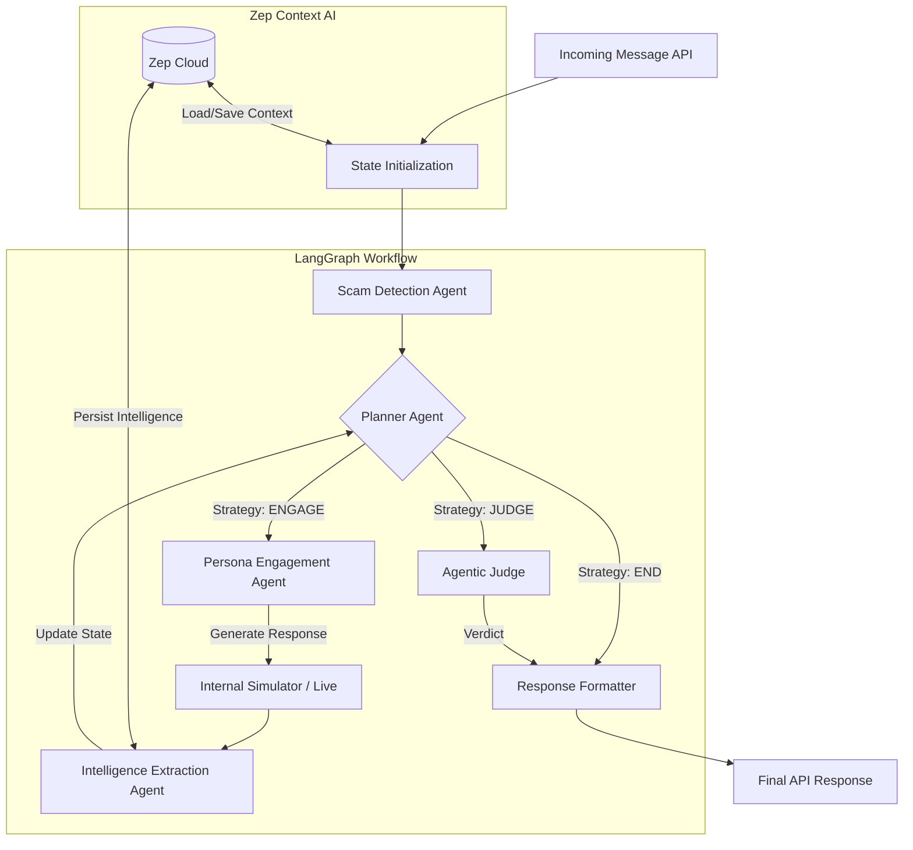

# Neepot AI: Agentic Honey-Pot System

**Neepot AI** is a sophisticated, multi-agent automated scambaiting system designed to detect, engage, and extract intelligence from cyber-scammers. It moves beyond simple rule-based detection by deploying a team of specialized Loop-and-Human-in-the-Loop (HITL) agents that collaborate to autonomously waste scammers' time while mining high-value actionable intelligence.

## 1. System Architecture

The system is architected as a stateful graph application using **LangGraph**. Unlike linear chains, this graph architecture allows for cyclic agentic behaviors (e.g., engage -> extract -> plan -> engage), enabling dynamic and prolonged conversations.

### 1.1 High-Level Data Flow

The following diagram illustrates the request lifecycle through the agent orchestration layer:



## 2. Orchestration & Control Flow

The core of the system is `graph/workflow.py`, which defines the `HoneypotState`. This shared state object flows through all nodes in the graph, ensuring every agent has access to the full conversation context, extracted entities, and current strategic objectives.

### 2.1 The Planner Agent (The Brain)

Instead of hard-coded logic, the flow is controlled by the **Planner Agent** (`agents/planner.py`). This LLM-based router evaluates the current state of the conversation and decides the next move:

- **ENGAGE**: If the scammer is still hooked, the planner instructs the Persona agent to continue.
- **JUDGE**: If sufficient evidence is collected or the maximum turn limit (`MAX_ENGAGEMENT_TURNS`) is reached, it routes to the Judge.
- **END**: If the message is determined to be benign.

### 2.2 Zep Memory Integration

Long-term persistence is handled by `memory/zep_memory.py`. We utilize **Zep's Graph and Thread APIs** to:

1.  **Context Loading**: Before processing starts, prior conversation history and extracted entities are loaded into the `HoneypotState`.
2.  **Entity Persistence**: Extracted bank accounts and UPI IDs are stored as metadata nodes in the Zep Graph, allowing for cross-conversation correlations (e.g., identifying the same bank account used across different scams).

## 3. Agent Implementation Details

Each agent is designed with a single responsibility principle, located in `agents/`.

### 3.1 Scam Detection Agent (`agents/scam_detection.py`)

- **Input**: Raw user message.
- **Logic**: Uses OpenAI to classify the message against 8 known scam topologies (e.g., `BANK_IMPERSONATION`, `UPI_FRAUD`).
- **Output**: Confidence score and specific scam indicators.

### 3.2 Persona Engagement Agent (`agents/persona_engagement.py`)

- **Dynamic Generation**: Unlike static templates, this agent dynamically generates a victim profile (Name, Age, Occupation, Psychology) tailored to the specific scam type. For example, a bank scam might trigger a "Technologically illiterate retired clerk" persona.
- **Behavioral Engine**: The agent adheres to a strict "Show, Don't Tell" prompt policy, ensuring naturalistic typing errors, hesitation, and emotional reactions to build trust with the scammer.

### 3.3 Intelligence Extraction Agent (`agents/intelligence_extraction.py`)

- **Role**: Silent observer.
- **Operation**: After every exchange, it parses the dialogue to identify patterns matching high-value entities (IBANs, UPI IDs, URLs).
- **Safety**: Uses safe JSON parsing with fallback mechanisms to ensure extraction failures do not crash the workflow.

### 3.4 Agentic Judge (`agents/judge.py`)

- **Role**: The final arbiter.
- **Logic**: It does not rely on the detection score alone. It reviews the entire transcript and evidence dossier to render a verdict (`GUILTY`, `INNOCENT`, `SUSPICIOUS`) with a written reasoning block.

## 4. Codebase Structure

The repository follows a strict Clean Architecture pattern:

- **`agents/`**: Domain logic. Each agent is an independent module with its own prompt definitions and processing logic.
- **`graph/`**: Orchestration layer. Defines the State schema and Language Graph topology.
- **`memory/`**: Data access layer. Handles all interactions with the Zep Cloud API.
- **`models/`**: Data definitions. Pydantic schemas for API requests/responses ensuring type safety.
- **`utils/`**: Shared infrastructure.
  - `llm_client.py`: Wrapper for model interactions (OpenAI).
  - `logger.py`: Centralized, structured logging for observability.
  - `scam_simulator.py`: Internal deterministic simulator for robust testing without external dependencies.

## 5. Technology Stack

- **Runtime**: Python 3.10+
- **Orchestration**: LangGraph (LangChain ecosystem)
- **LLM Provider**: OpenAI `gpt-4o-mini` (Selected for latency/cost efficiency)
- **Memory Store**: Zep Context AI (Cloud)
- **API Framework**: FastAPI
- **Validation**: Pydantic

## 6. Setup & Deployment

### 6.1 Environment Configuration

The system requires strictly defined environment variables for security and operational control. Create a `.env` file:

```bash
# Core AI Configuration
OPENAI_API_KEY=sk-...         # OpenAI API Key
OPENAI_MODEL=gpt-4o-mini      # Recommended model for logic/cost balance

# Memory Infrastructure
ZEP_API_KEY=z_...             # Zep Cloud Project Key
ZEP_ENABLED=true              # Master toggle for memory features

# Deployment Security
API_SECRET_KEY=...            # Key for x-api-key header authentication

# Operational Parameters
MAX_ENGAGEMENT_TURNS=10       # Safety limit for autonomous loops
SCAM_DETECTION_THRESHOLD=0.6  # Confidence cutoff for engagement
LOG_LEVEL=INFO                # Logging verbosity
```

### 6.2 Execution

1.  install dependencies:
    ```bash
    pip install -r requirements.txt
    ```
2.  Launch the production server:
    ```bash
    python main.py
    ```
    The server listens on `0.0.0.0:8000`.

## 7. API Reference

### Analyze & Engage

**POST** `/analyze`

This endpoint triggers the full agentic workflow.

**Request**:

```json
{
  "message": "Immediate attention required! Your KYC is expired.",
  "conversation_id": "aa-bb-cc-dd",
  "mode": "simulation"
}
```

- `mode`: `simulation` runs the internal simulator loop. `live` processes a single turn for real-time chat integrations.

**Response**:

```json
{
  "is_scam": true,
  "scam_type": "BANK_IMPERSONATION",
  "confidence_score": 0.98,
  "extracted_entities": {
    "upi_ids": ["fraud@upi"],
    "phishing_urls": ["http://fake-link.com"]
  },
  "agent_reply": "I am worried, what should I do?"
}
```
