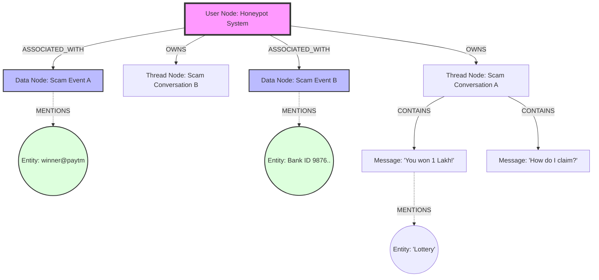

# Deep Dive: The Zep Knowledge Graph Structure

This document details exactly what nodes and edges we are creating in the Zep graph and how they connect to power the Agentic Honey-Pot.

## 🕸️ The Graph Schema

We are building a **Star Topology** graph centered around the `Honeypot System` user, with connections to ephemeral Scammer identities and persistent Scam Intelligence.



---

## 🟢 Node Types Explaicned

### 1. The Anchor Node: `Honeypot System` (User)

- **What is it?** A persistent "User" in Zep representing our AI system.
- **Why?** All intelligence must hang off a stable identity so we can search it later.
- **Code:** `client.user.add(user_id="honeypot-system")`

### 2. The Data Nodes: `Scam Intelligence` (JSON)

- **What is it?** A structured JSON blob we inject after every detection.
- **Content:**
  ```json
  {
    "event_type": "scam_detected",
    "scam_type": "LOTTERY_FRAUD",
    "upi_ids": ["winner@paytm"],
    "confidence_score": 0.95
  }
  ```
- **Connection:** Connected to `Honeypot System`.
- **Why?** This allows us to ask semantically: _"Show me all high-confidence lottery scams."_

### 3. The Thread Nodes: `Conversations`

- **What is it?** A container for a specific chat session with a scammer.
- **Connection:** Linked to `Honeypot System`.
- **Why?** Keeps messages organized chronologically.

### 4. The Entity Nodes: `Facts` (Auto-Generated)

- **What is it?** Zep's NLP _automatically_ reads our messages and JSON data and creates nodes for recognized entities.
- **Examples:**
  - **Payment ID**: `winner@paytm`
  - **Organization**: `SBI Bank`
  - **Concept**: `Lottery`
- **The "Magic" Connection:** If Thread A mentions `winner@paytm` and Thread B mentions `winner@paytm`, Zep silently links them. This means Thread A and B are now semantically connected in the graph!

---

## 🔗 How Nodes Connect (The Process)

### Step 1: Connecting Thread to System

When we start a chat:

```python
client.thread.create(thread_id="scam-001", user_id="honeypot-system")
```

**Graph Result:** `Honeypot System` ──(OWNS)──► `Thread "scam-001"`

### Step 2: Adding Messages

When the scammer sends "Pay me":

```python
client.thread.add_messages(...)
```

**Graph Result:** `Thread "scam-001"` ──(CONTAINS)──► `Message "Pay me"`

### Step 3: Injecting Intelligence (The Critical Step)

After analysis, we push the JSON:

```python
client.graph.add(user_id="honeypot-system", data=intelligence_data)
```

**Graph Result:**

1.  Creates a new `Data Node`.
2.  `Honeypot System` ──(HAS_EVENT)──► `Data Node`.
3.  Zep analyzes the JSON. It sees `"upi_ids": ["winner@paytm"]`.
4.  It creates/finds the Entity Node `winner@paytm`.
5.  `Data Node` ──(MENTIONS)──► `Entity "winner@paytm"`.

---

## 🕵️ How traversing this Graph helps

Because of these connections, we can do powerful queries.

**Query:** _"Has anyone asked for payment to this UPI before?"_

1.  System searches for `winner@paytm`.
2.  Finds the **Entity Node**.
3.  Follows edges back to all **Data Nodes** connected to it.
4.  Follows those back to the **Honeypot User** timeline.
5.  **Result:** "Yes, we saw this UPI in Thread A (2 days ago) and Thread B (today)."

**Query:** _"What are the common tactics?"_

1.  System looks for similar **Data Nodes**.
2.  Finds clusters of nodes with `scam_type: "BANK_IMPERSONATION"`.
3.  **Result:** "80% of recent scams involve impersonating SBI Bank."

This graph structure turns isolated chats into a **connected intelligence network**.
